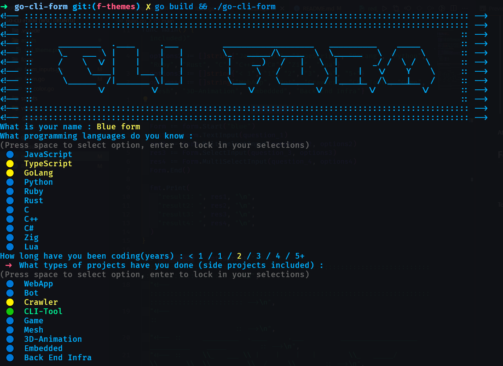
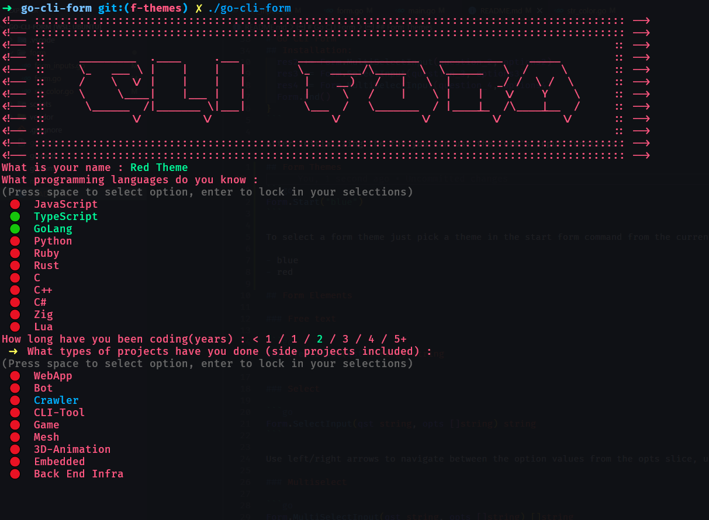

# 🚀 Go CLI Form

A simple library focused on creating a web-form like for quick & dirty cli user interactions.

## 💾 Installation / Usage

run `go get github.com/DimRev/go-cli-form`

To Create a quick cli form put init the form struct using `Form.Start()`

```go
func main(){
  Form := Form.Start("blue")

  // Questions
  question_1 := "What is your name"
  question_2 := "What programming languages do you know"
  question_3 := "How long have you been coding(years)"
  question_4 := "What types of projects have you done (side projects included)"

  // Options
  options2 := []string{"JavaScript", "TypeScript", "GoLang", "Python", "Ruby", "Rust", "C", "C++", "C#", "Zig", "Lua"}
  options3 := []string{"< 1", "1", "2", "3", "4", "5+"}
  options4 := []string{"WebApp", "Bot", "Crawler", "CLI-Tool", "Game", "Mesh", "3D-Animation", "Embedded", "Back End Infra"}

  // Form creation
  Form := form.Start()
  res1 := Form.TextInput(question_1)
  res2 := Form.MultiSelectInput(question_2, options2)
  res3 := Form.SelectInput(question_3, options3)
  res4 := Form.MultiSelectInput(question_4, options4)
  Form.End()
}
```

After initializing the for you can use the form's input functions:

## 🎨 Form Themes

```go
Form.Start("blue")
```

To select a form theme just pick a theme in the start form command from the currently available themes

- default
- blue
  
- red
  

## 📝 Form Elements

### Free text

```go
Form.TextInput(qst string) string
```

### Select

```go
Form.SelectInput(qst string, opts []string) string
```

Use left/right arrows to navigate between the option values from the opts slice, use enter to submit the selection

### Multiselect

```go
Form.MultiSelectInput(qst string, opts []string) []string
```

Using up/down to navigate the options from the options slice, use space to select the option, and enter to submit selection

## 🚔 TODO / Roadmap

- [x] Customize form styles/themes
- [ ] Implement testing
- [ ] Add instructions under the current selected
- [ ] Implement steps
- [ ] Implement back/forward navigation between steps
- [ ] Animate a loader/progress bar
- [ ] Add checkbox element
- [ ] Add password section / hidden text field
- [ ] Add textarea / multi-line element

## 🤝 Contributing

### Clone the repo

```bash
git clone https://github.com/DimRev/go-cli-form@latest
cd go-cli-form
```

### Build the project

```bash
go build
```

### Run the project

```bash
./go-cli-form
```

### Run the tests (\*\*need to implement)

```bash
go test ./...
```

### Submit a pull request

If you'd like to contribute, please fork the repository and open a pull request to the `master` branch.
